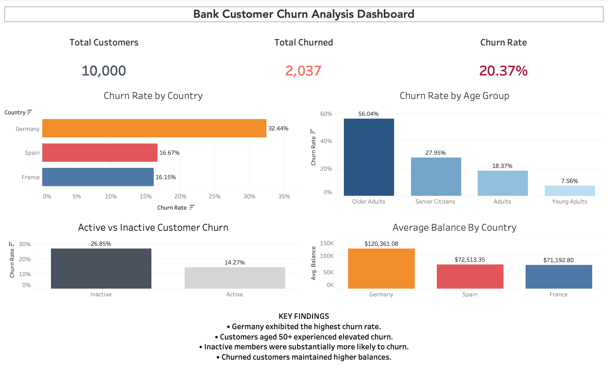

# Bank-Customer-Churn-Analysis

##   Business Problem 
- **Retail banks lose significant revenue from customer attrition. This project analyzes customer demographics and behavior to identify high-risk groups and recommend targeted retention strategies.**

## 🎯 Project Overview
- **Analyzed customer churn patterns using SQL and Tableau**
- **Identified demographic and behavioral factors associated with customer attrition**

## 🛠️ Tools Used
- **SQL**
- **Tableau**

## ⚡ Dataset
- **10,000 customer records**
- **Variables included geography, age, account balance, activity status, and churn status**

## Dashboard Preview

## 📊 Key Findings
- **Germany had the highest churn rate (32.44%)**
- **Customers aged 50+ churned at significantly higher rates**
- **Inactive customers churned nearly twice as often as active customers**
- **Churned customers maintained higher average balances**

## 💼 Business Recommendations
- **Launch retention campaigns for inactive customers**
- **Develop loyalty programs for older customers**
- **Monitor high-balance accounts for early churn indicators**

## 📧 Contact

**Jonathan Park** - Information Systems Student & Data Analyst Enthusiast

- 📧 Email: psj10502@gmail.com
- 💼 LinkedIn: [linkedin.com/in/jonathanspark](https://www.linkedin.com/in/jonathanspark/)
- 📱 GitHub: [@Jpark0915](https://github.com/Jpark0915)
